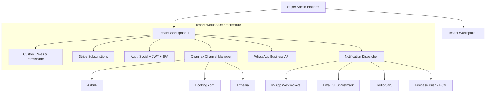
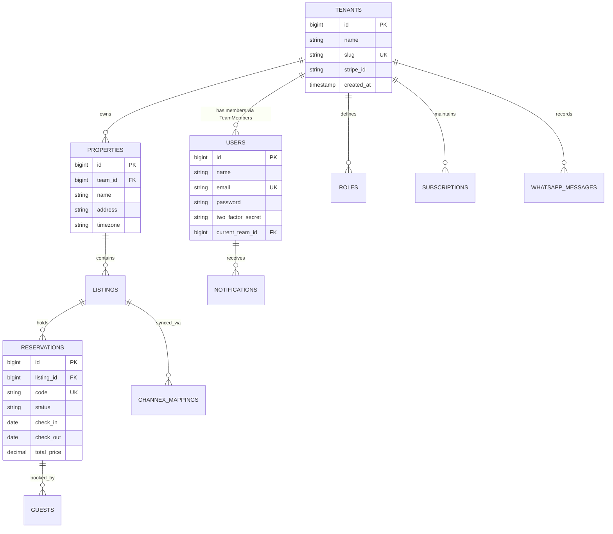

# Guesty PMS - Product Brain & Architecture Specification

## Executive Summary & Product Vision

**Guesty PMS** is an enterprise-grade Multi-Tenant Property Management System (PMS) designed for hospitality operators, vacation rental managers, boutique hotels, and property management companies. Built on a modern tech stack (**Laravel 13**, **React 19**, **Inertia.js 3**, **TypeScript**, and **Tailwind CSS 4**), the platform consolidates property operations, multi-channel distribution, automated guest messaging, subscription billing, and multi-channel notifications into a unified cloud workspace.

---

## Technical Stack Overview

- **Backend Framework**: Laravel 13.x (PHP 8.3+)
- **Frontend Engine**: React 19.x with Inertia.js 3.0 & TypeScript
- **Styling & UI Components**: Tailwind CSS 4.x, Radix UI Primitives, Lucide Icons, Sonner Notifications
- **Authentication & Security**: Laravel Fortify (2FA, Passkeys/WebAuthn), Socialite (OAuth), Sanctum/JWT for APIs
- **Database & Queue**: PostgreSQL / MySQL, Redis (Queueing, Caching, & WebSockets)
- **Asset Bundling**: Vite 8.x with Wayfinder routing

---

## Key Core Features & System Specifications

### 1. Multi-Tenant Architecture

- **Tenant Scoping & Data Isolation**: Shared database architecture with logical tenant isolation (`team_id` / `tenant_id` foreign keys indexed on every tenant-aware model).
- **Tenant Context Resolution**: Middleware pipeline resolving tenant context via:
  1. Subdomain (`{tenant}.guestypms.com`)
  2. Custom Domain (`pms.propertygroup.com`)
  3. Route parameter prefix (`app.guestypms.com/w/{tenant_slug}`)
  4. User session / current active team selection (`current_team_id` on [User](./app/Models/User.php)).
- **Database Scoping**: Automatic Global Scope (`TenantScope`) attached to Eloquent models ensuring strict cross-tenant data leakage prevention.
- **Resource Quotas**: Tenant-level enforcement of maximum listings, staff accounts, WhatsApp message credits, and storage usage based on active subscription tier.

### 2. User Roles & Granular Permission Engine (RBAC)

- **System Level Roles**:
  - `Super Admin`: Platform owner with global access to tenant management, subscription overview, platform telemetry, system settings, and audit logs.
- **Tenant Workplace Roles**:
  - `Tenant Admin (Workplace Owner)`: Full administrative rights over a specific tenant workplace, billing, integrations, properties, and role definitions.
  - `Predefined Roles`: General Manager, Front Desk Manager, Housekeeping Manager, Maintenance Lead, Revenue Manager, Finance/Accountant.
  - `Custom Workplace Roles`: Tenant Admins can dynamically define new workplace roles with custom permission matrices tailored to their organizational hierarchy.
- **Permission Granularity**: Action-based and resource-based permissions (e.g., `properties:create`, `reservations:read`, `reservations:modify-pricing`, `housekeeping:assign-tasks`, `financials:export`).

### 3. Subscription & Payment Engine (Stripe Integration)

- **Billing Library**: Laravel Cashier for Stripe.
- **Subscription Models**:
  - **Tiered Plans**: Starter (up to 5 properties), Growth (up to 25 properties), Enterprise (unlimited).
  - **Usage-Based Add-Ons**: Billable per active listing, extra WhatsApp message blocks, high-frequency Channex sync intervals.
- **Self-Service Billing Portal**: Stripe Customer Portal integration for automated invoice generation, card updating, plan upgrades/downgrades, and cancellation flows.
- **Webhook Automation**: Robust event handlers listening to Stripe webhooks (`invoice.payment_succeeded`, `customer.subscription.deleted`, `invoice.payment_failed`) to automatically alter tenant subscription status and send notifications.

### 4. Authentication & Security Engine

- **Multi-Guard Setup**:
  - Web Guard: Stateful session authentication powered by Laravel Fortify and Inertia.js.
  - API / Mobile Guard: JWT (JSON Web Tokens) with short-lived access tokens and secure refresh token rotation strategy.
- **Social Login**: Multi-provider OAuth 2.0 via Laravel Socialite (Google Workspace, Apple ID, Microsoft Azure AD).
- **Two-Factor Authentication (2FA)**:
  - TOTP Authenticator app support (Google Authenticator, Authy, 1Password) with recovery codes.
  - WebAuthn / Passkeys support (biometric login via TouchID, FaceID, YubiKey) integrated via `@laravel/passkeys`.

### 5. Channex Integration (OTA Channel Manager)

- **Provider**: Integration with Channex.io REST API and Webhooks.
- **2-Way Sync Capabilities**:
  - **ARI Push (Availability, Rates & Inventory)**: Instant delta updates pushed from Guesty PMS to Channex whenever reservations, blockouts, or pricing changes occur.
  - **Reservation Ingestion**: Real-time webhook listener receiving new bookings, modifications, and cancellations from external OTAs (Airbnb, Booking.com, VRBO, Expedia, Agoda).
- **Channel Mapping**: Visual UI mapping PMS properties, room types, and rate plans to corresponding Channex Property IDs and Channel Rate Plans.
- **Sync Logs & Conflict Resolution**: Audit log of all API payload exchanges with automatic retry mechanism for failed channel syncs.

### 6. WhatsApp Business API Integration

- **Provider Options**: Meta Cloud API / Twilio for WhatsApp API.
- **Automated Messaging Flows**:
  - Instant Booking Confirmation with reservation summary.
  - Pre-Arrival / Check-in instructions (Digital Key, directions, house rules) sent 24h prior to arrival.
  - In-Stay support and upsell messages.
  - Post Check-out thank-you & review request.
- **Unified Guest Chat Inbox**: Interactive React-powered chat interface allowing staff to respond to guest messages in real-time.
- **WhatsApp Template (HSM) Management**: UI for creating, previewing, and tracking status of WhatsApp business message templates submitted for Meta approval.

### 7. Multi-Channel Notification Dispatcher

Centralized event-driven notification architecture supporting four distribution channels:

| Channel | Technology | Target Use Cases |
| :--- | :--- | :--- |
| **In-App** | WebSockets (Laravel Reverb / Pusher) | Real-time dashboard alerts, unread counter, drawer UI |
| **Email** | Laravel Mail (Postmark / AWS SES) | Booking receipts, monthly invoices, password resets, system reports |
| **SMS** | Twilio / Vonage SMS API | Time-critical staff alerts, urgent guest messaging |
| **Push** | Firebase Cloud Messaging (FCM) | iOS, Android, & Web PWA background push notifications |

- **Notification Preferences Matrix**: Per-user and per-tenant settings enabling/disabling channels for specific notification classes (e.g., New Reservation, Housekeeping Update, Payment Failed).

---

## Domain Data Model Architecture

---

## System Roadmap & Implementation Strategy

### Phase 1: Core Foundation & Multi-Tenancy (Completed Base)
- [x] Laravel 13 + Inertia 3 + React 19 Starter setup
- [x] Team/Tenant model integration ([Team.php](./app/Models/Team.php), [Membership.php](./app/Models/Membership.php))
- [x] Fortify Authentication & 2FA base ([User.php](./app/Models/User.php))

### Phase 2: Role & Permission Engine & Subscription
- [ ] Platform Super Admin dashboard & Tenant Admin role management
- [ ] Dynamic custom workspace roles & permission matrix table
- [ ] Stripe Cashier billing integration with tiered plans & customer portal

### Phase 3: Auth Enhancements & Security
- [ ] Socialite integration for OAuth (Google, Apple, Microsoft)
- [ ] JWT authentication guard for mobile & REST APIs
- [ ] WebAuthn / Passkeys verification polishing

### Phase 4: Distribution & Channel Manager (Channex)
- [ ] Channex REST client service & Webhook controller
- [ ] Property/Listing to Channex channel mapping interface
- [ ] Real-time 2-way ARI sync queue & log viewer

### Phase 5: Guest Communication & Notifications
- [ ] WhatsApp Business Meta Cloud API integration
- [ ] Unified guest messaging drawer & HSM template manager
- [ ] Multi-channel Notification Dispatcher (In-App WebSockets, Email, SMS, FCM Push)
